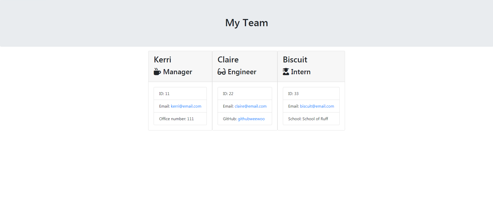

# Employee-Summary
  
  
## Description
  
 A CLI app that will prompt the user to enter information about their team and then build and HTML file with a card for each individual on the team.
  
## Table of Contents

- [Installation](https://github.com/kas1330/Employee-Summary#installation)

- [Usage](https://github.com/kas1330/Employee-Summary#usage)

- [License](https://github.com/kas1330/Employee-Summary#license)

- [Contributions](https://github.com/kas1330/Employee-Summary#contributions)

- [Testing](https://github.com/kas1330/Employee-Summary#testing)

- [Questions](https://github.com/kas1330/Employee-Summary#questions)

- [Repo](https://github.com/kas1330/Employee-Summary#repo)

- [Demonstration](https://github.com/kas1330/Employee-Summary#demonstration)

## Installation

 Use npm i to install inquirer.

## Usage

 Use node.js to run the application. Use npm i to install inquirer. 

## License

 None

## Contributions

 Submit a pull request.

## Testing

 Use Jest to test the class files with the given test files.

## Questions

 https://github.com/kas1330

 k.sexton804@gmail.com

 ## Repo

 https://github.com/kas1330/Employee-Summary
 
## Demonstration

https://drive.google.com/file/d/1cDqSBbxoWg8v1Wm6C-AJ68mGfArIV7ZZ/view?usp=sharing
